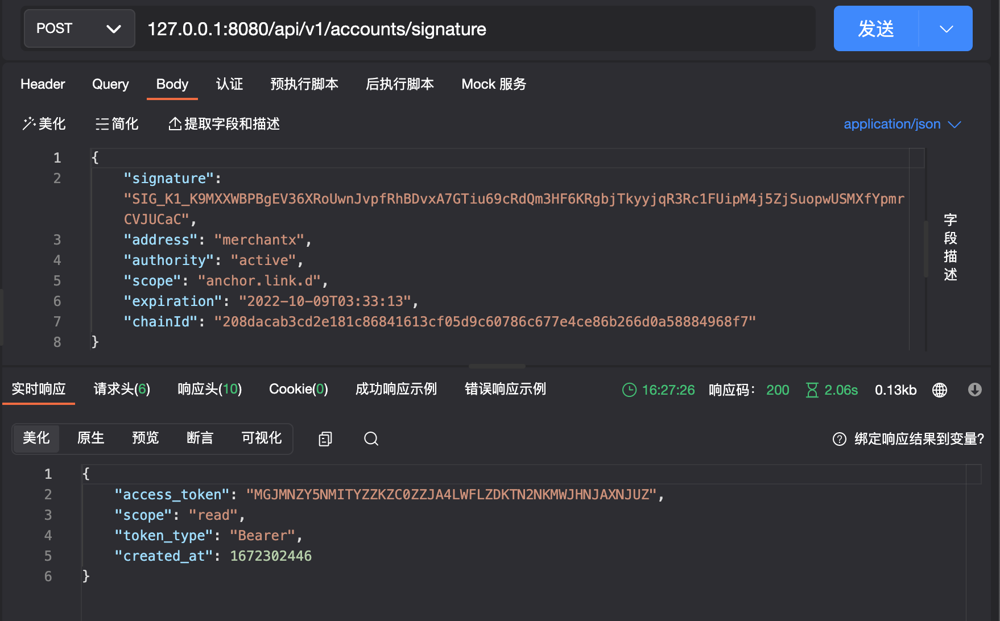

#   Amax 签名登录



### 请求参数是客户端扫码签名后返回的结果
```
{
  "chainId":"208dacab3cd2e181c86841613cf05d9c60786c677e4ce86b266d0a58884968f7",
  "scope":"anchor.link.d",
  "expiration":"2022-10-09T03:33:13",
  "signer":{
      "actor":"merchantx",

      "permission":"active"
  },
  "signature":"SIG_K1_K9MXXWBPBgEV36XRoUwnJvpfRhBDvxA7GTiu69cRdQm3HF6KRgbjTkyyjqR3Rc1FUipM4j5ZjSuopwUSMXfYpmrCVJUCaC"
}
```

### 签名登录返回结果
```
{
	"access_token": "MDAYNDLKN2UTMWE0ZI0ZNZG4LWEZZMQTY2I4YJM4NZCYOTGW",
	"scope": "read",
	"token_type": "Bearer",
	"created_at": 1672302908
}
```